# SeniorEase

**Plataforma de acessibilidade para idosos em ambientes acadêmicos e profissionais.**

Flutter (Web + Mobile) · Firebase · Riverpod · Clean Architecture

[](https://github.com/GM-Ferreira/postech-senior-ease/actions/workflows/ci-cd.yml)

---

## Sobre o projeto

O **SeniorEase** é uma plataforma projetada para tornar a rotina digital de idosos mais simples, segura e acessível. O app oferece um organizador de tarefas com interface adaptativa e um painel completo de personalização visual — tudo pensado para respeitar as limitações e preferências de cada usuário.

### Problema

Idosos em ambientes acadêmicos e profissionais enfrentam barreiras significativas em plataformas digitais: fontes pequenas, contrastes inadequados, excesso de informação visual e falta de confirmações em ações críticas.

### Solução

Uma plataforma accessibility-first que coloca o usuário no controle total da sua experiência visual, com:

- **8 configurações de acessibilidade** ajustáveis em tempo real
- **Modo básico vs avançado** para diferentes níveis de conforto
- **Onboarding guiado** que configura preferências antes do primeiro uso
- **Tutorial interativo** na primeira visita à tela principal
- **Feedback reforçado** e **confirmação de ações críticas** opcionais

---

## Funcionalidades

### Autenticação

- Login com email/senha e Google Sign-In
- Cadastro e recuperação de senha
- Splash screen com verificação automática de sessão

### Organizador de tarefas

- Criação de tarefas com prioridade (alta, média, baixa) e data de vencimento
- **Modo básico**: lista simples com aviso de atraso
- **Modo avançado**: tarefas organizadas por urgência (atrasadas → hoje → próximas)
- Indicadores visuais de prioridade e vencimento
- Histórico de tarefas concluídas
- Confirmação opcional antes de excluir

### Painel de acessibilidade (Settings)

| Configuração | Opções |
| --- | --- |
| **Tamanho do texto** | Normal · Grande (1.3x) · Muito grande (1.6x) |
| **Tema** | Automático (sistema) · Claro · Escuro |
| **Contraste** | Normal · Alto · Muito alto |
| **Espaçamento** | Compacto (0.8x) · Normal · Espaçoso (1.5x) |
| **Animações** | Ativadas · Reduzidas |
| **Modo de exibição** | Básico · Avançado |
| **Feedback visual** | Normal · Reforçado (diálogos de confirmação) |
| **Segurança** | Confirmação antes de ações críticas |

Todas as preferências são salvas no Firestore e sincronizadas entre dispositivos.

### Acessibilidade

- Alvos de toque mínimo de 48x48dp
- Labels semânticos para leitores de tela
- Suporte a alto contraste
- Respeito às configurações do sistema operacional (`MediaQuery`)
- Restaurar padrões com um toque

### Responsividade

- **Mobile** (< 600px): navegação por barra inferior
- **Web** (≥ 600px): navegação por drawer lateral
- Layout adaptativo com largura máxima controlada

---

## Web

### Splash

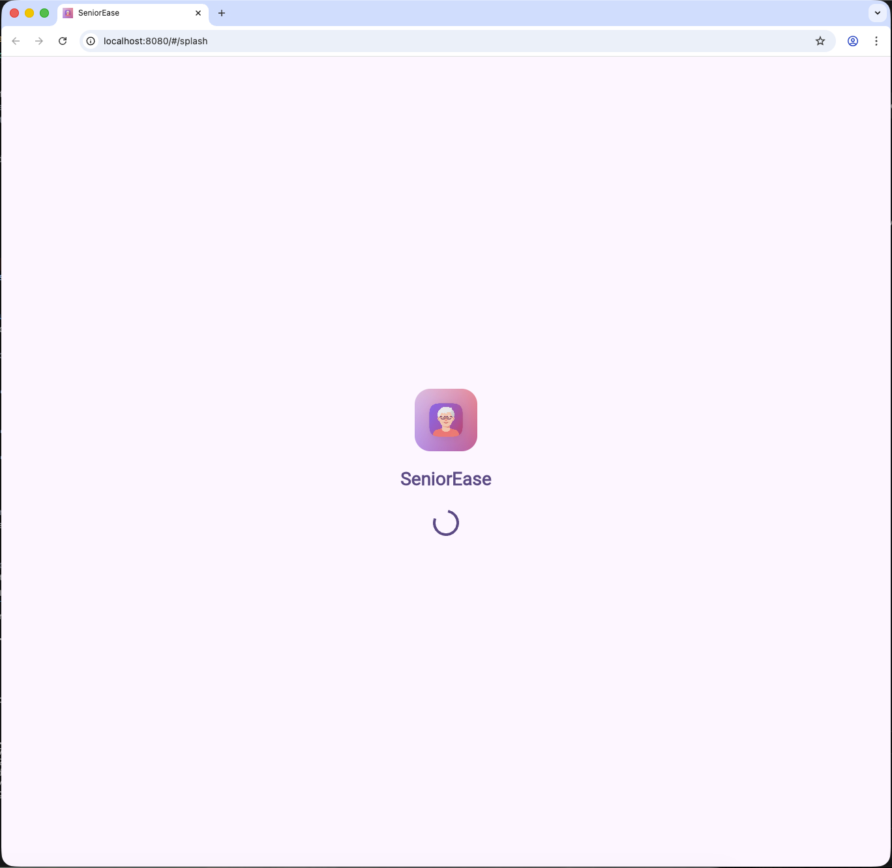

### Login

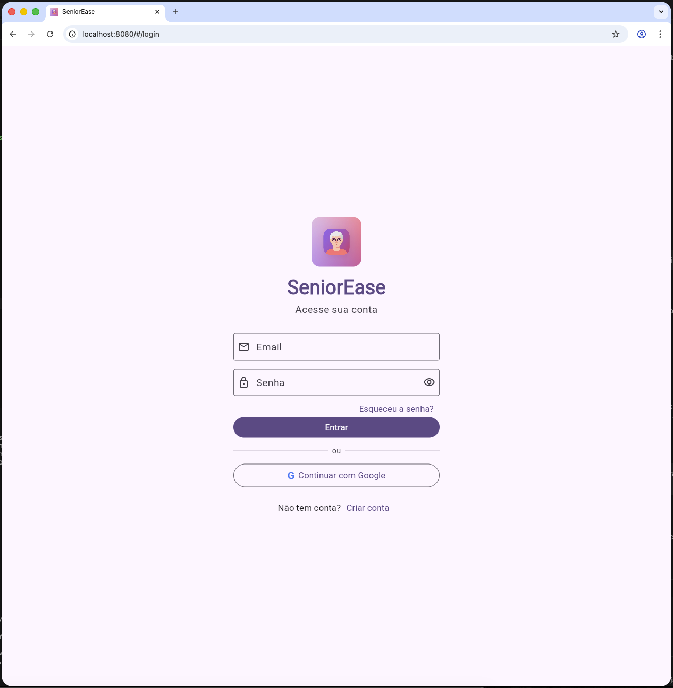

### Home

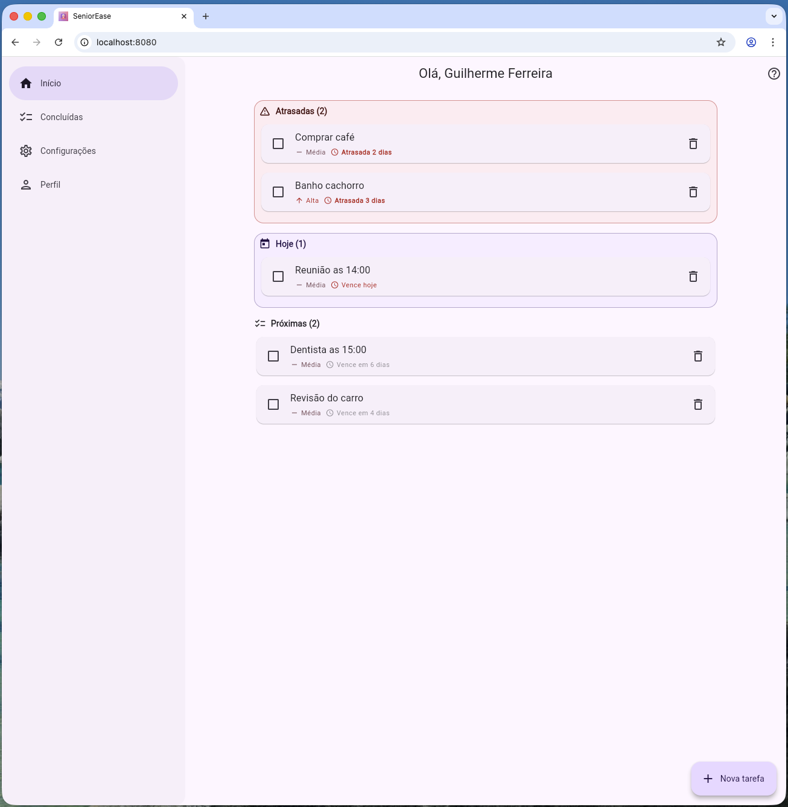

### Settings

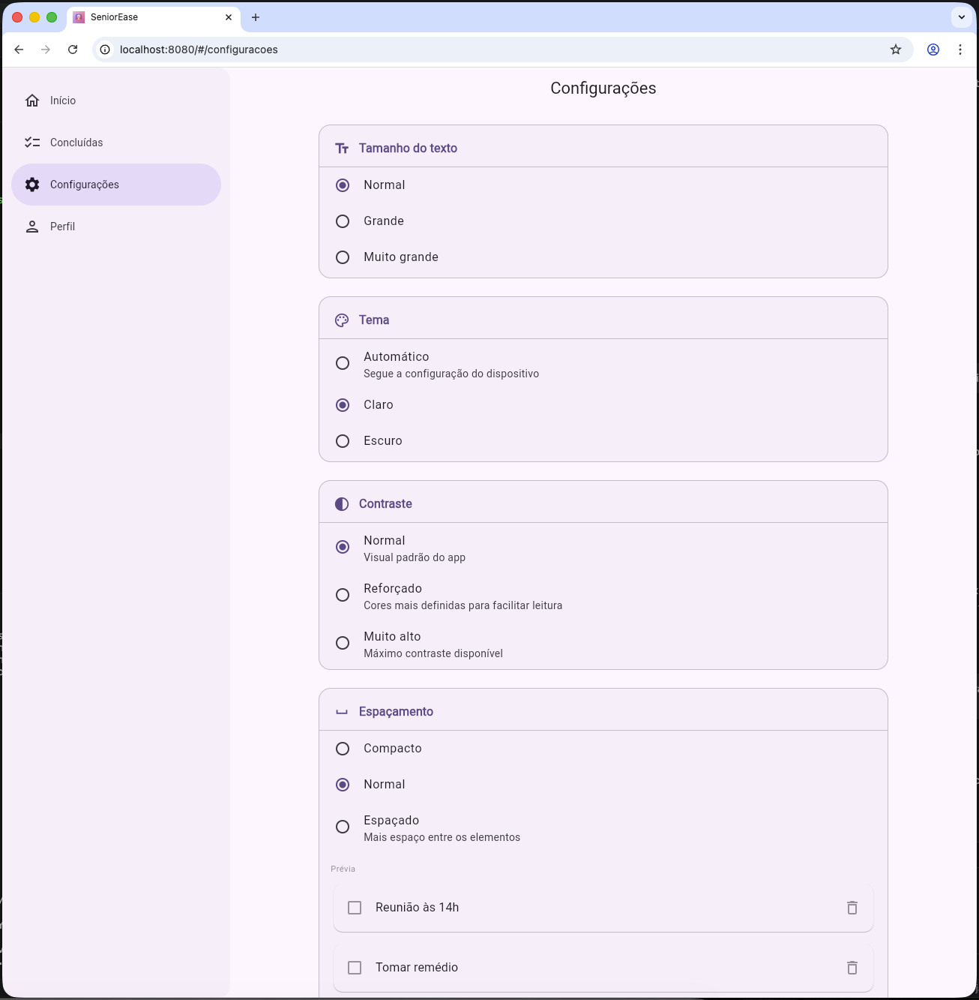

### Profile

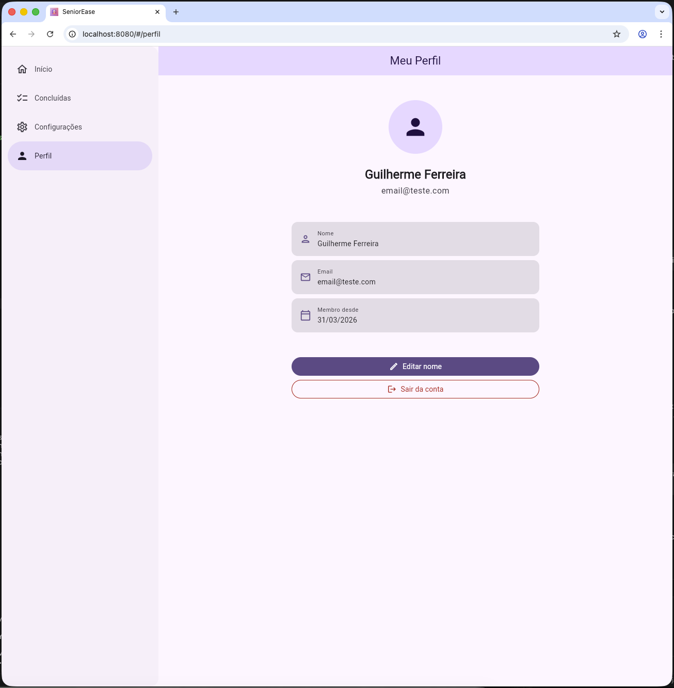

### Onboarding

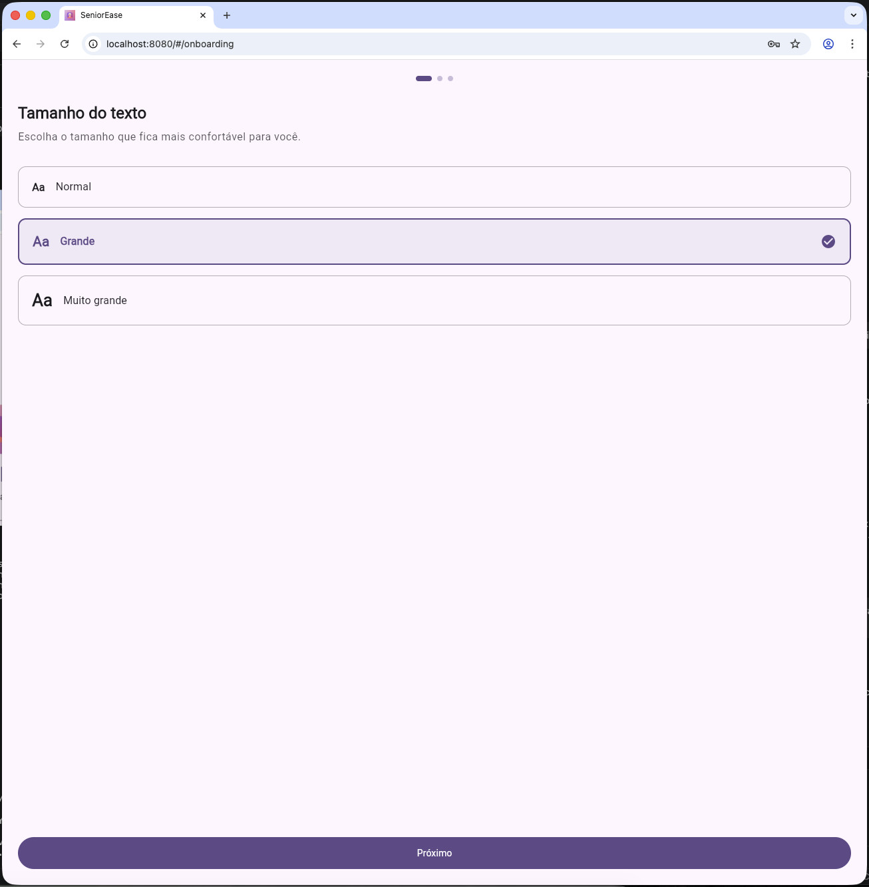

---

## Mobile

### Splash-app

<!-- markdownlint-disable MD033 -->
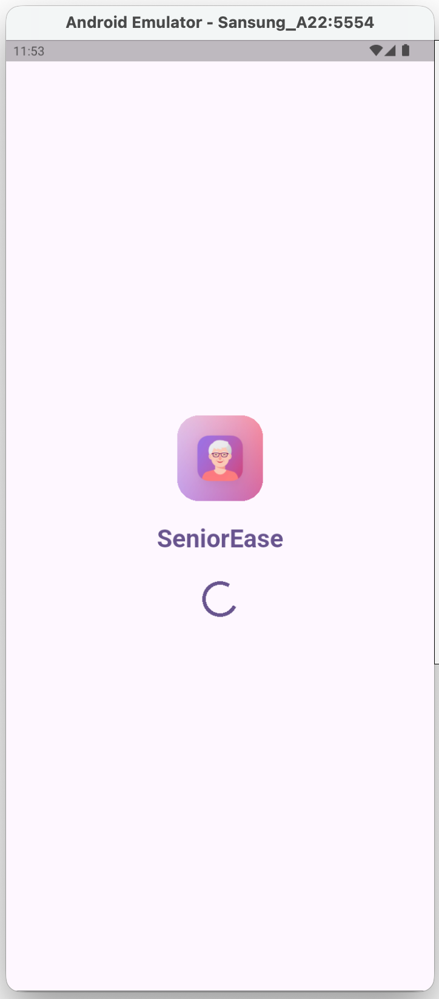

### Login-app

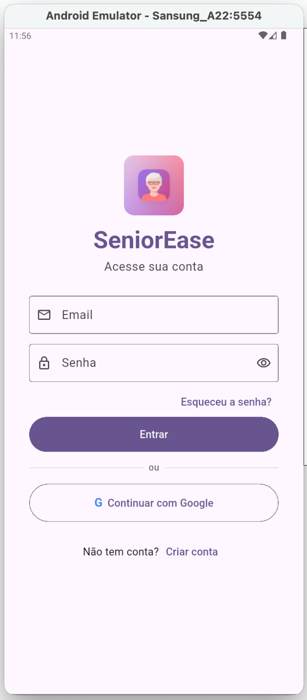

### Home-app

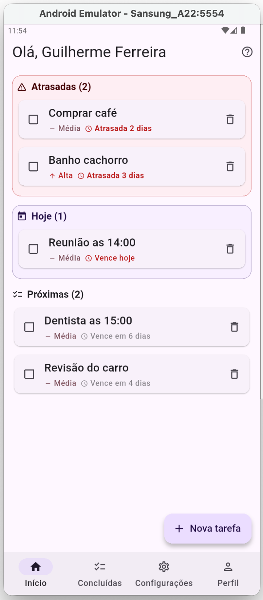

### Settings-app

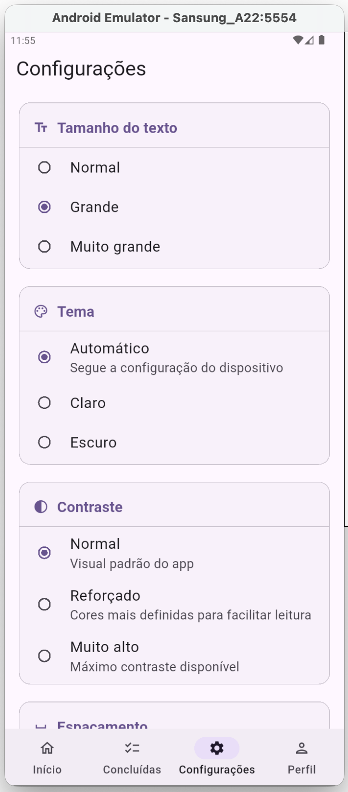

### Profile-app

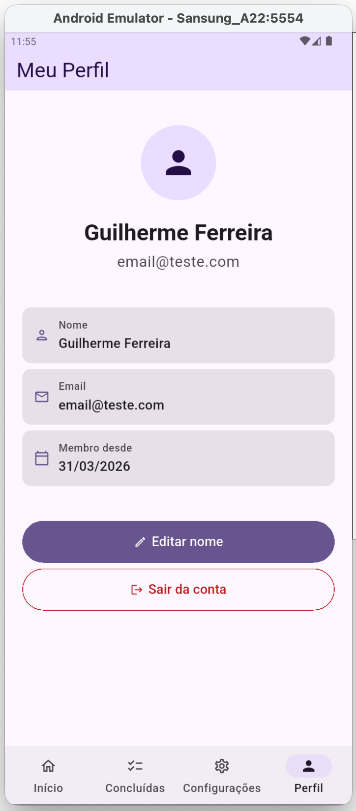

### Onboarding-app

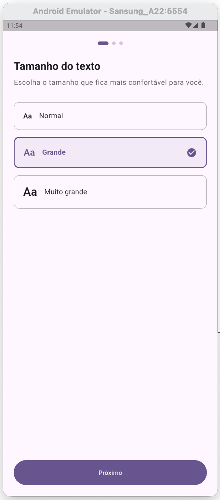

---

## Arquitetura

O projeto segue **Clean Architecture** com 3 camadas desacopladas:

```text
lib/
├── core/                    # Camada de Domínio
│   ├── entities/            #   AppUser, Task, UserPreferences
│   ├── repositories/        #   Interfaces abstratas
│   └── usecases/            #   Regras de negócio
│
├── data/                    # Camada de Dados
│   ├── datasources/         #   Firebase Auth, Firestore
│   └── repositories/        #   Implementações dos repositories
│
├── presentation/            # Camada de Apresentação
│   ├── pages/               #   9 páginas (login, home, settings...)
│   ├── providers/           #   12 providers Riverpod
│   ├── adaptive/            #   Scaffold e containers responsivos
│   └── shared/              #   Componentes reutilizáveis
│
├── config/
│   ├── theme/               #   AppTheme, AppSpacing
│   └── routes/              #   GoRouter
│
└── main.dart
```

### Stack tecnológica

| Tecnologia | Uso |
| --- | --- |
| **Flutter** | Framework cross-platform (Web + Mobile) |
| **Firebase Auth** | Autenticação (email/senha + Google) |
| **Cloud Firestore** | Banco de dados (tarefas + preferências) |
| **Riverpod** | Gerenciamento de estado e DI |
| **GoRouter** | Navegação declarativa |
| **Material Design 3** | Sistema de design |
| **GitHub Actions** | CI/CD (testes, build, deploy) |
| **Vercel** | Hospedagem do app web |

---

## Testes

**154 testes** · **66.4% de cobertura** · **0 falhas**

A estratégia de testes prioriza **100% de cobertura nas camadas que não dependem de infraestrutura** (entidades, providers, tema) e **cobertura de UI e interações** nas páginas. A cobertura parcial nas páginas (46-76%) corresponde às linhas dentro de callbacks que executam chamadas reais ao Firebase (Auth, Firestore) — o clique e a renderização são testados, mas a execução do serviço externo não é simulada. Os 31 testes de acessibilidade validam guidelines reais do Material Design (`androidTapTargetGuideline`, `textContrastGuideline`, `labeledTapTargetGuideline`) em todas as 9 páginas do app.

| Camada | Testes | Cobertura |
| --- | --- | --- |
| Entidades (AppUser, Task, UserPreferences) | 31 | 100% |
| Providers (9 notifiers) | 21 | 100% |
| Tema (AppSpacing) | 9 | 100% |
| SettingsPage | 23 | 98.3% |
| OnboardingPage | 11 | 97.8% |
| main.dart | — | 90.9% |
| ProfilePage | 9 | 76.1% |
| SignUpPage | 7 | 66.2% |
| LoginPage | 5 | 63.0% |
| CompletedTasksPage | 8 | 55.9% |
| HomePage | 8 | 51.8% |
| ForgotPasswordPage | 4 | 46.6% |
| Acessibilidade (9 páginas) | 31 | — |

```bash
# Rodar testes
flutter test

# Rodar com cobertura
flutter test --coverage
```

---

## CI/CD

Pipeline automatizada via GitHub Actions ([ci-cd.yml](.github/workflows/ci-cd.yml)):

| Etapa | PR para main | Push na main |
| --- | :---: | :---: |
| Análise estática (`flutter analyze`) | ✅ | ✅ |
| Testes (`flutter test`) | ✅ | ✅ |
| Build web | ✅ | ✅ |
| Deploy Vercel (produção) | — | ✅ |
| Build APK | — | ✅ |
| Upload APK como artifact | — | ✅ |

O APK gerado fica disponível na aba **Actions** do repositório por 90 dias.

---

## Como rodar

### Pré-requisitos

- [Flutter SDK](https://docs.flutter.dev/get-started/install) (canal stable)
- [Firebase CLI](https://firebase.google.com/docs/cli) (para configuração)
- Chrome (para web) ou emulador Android

### Setup

```bash
# Clonar o repositório
git clone https://github.com/GM-Ferreira/postech-senior-ease.git
cd postech-senior-ease

# Instalar dependências
flutter pub get

# Rodar no Chrome (web)
flutter run -d chrome --web-port 8080

# Rodar no emulador Android
flutter run -d emulator-5554
```

### Configurar Firebase

Os arquivos `lib/firebase_options.dart` e `android/app/google-services.json` não são versionados por segurança.

**Opção A — FlutterFire CLI (recomendado):**

```bash
dart pub global activate flutterfire_cli
firebase login
flutterfire configure
```

**Opção B — Manual:**

1. Copie `lib/firebase_options_template.dart` para `lib/firebase_options.dart`
2. Substitua os placeholders `{{...}}` pelos valores do seu projeto Firebase
3. Baixe o `google-services.json` do Firebase Console e coloque em `android/app/`

---

## Secrets do CI/CD

No GitHub, vá em **Settings > Secrets and variables > Actions** e crie:

### Firebase

| Secret | Descrição |
| --- | --- |
| `FIREBASE_WEB_API_KEY` | API Key do app web |
| `FIREBASE_WEB_APP_ID` | App ID do app web |
| `FIREBASE_ANDROID_API_KEY` | API Key do app Android |
| `FIREBASE_ANDROID_APP_ID` | App ID do app Android |
| `FIREBASE_MESSAGING_SENDER_ID` | Messaging Sender ID |
| `FIREBASE_PROJECT_ID` | Project ID |
| `FIREBASE_AUTH_DOMAIN` | Auth Domain |
| `FIREBASE_STORAGE_BUCKET` | Storage Bucket |
| `FIREBASE_MEASUREMENT_ID` | Measurement ID (web) |
| `GOOGLE_ANDROID_CLIENT_ID` | OAuth client_id Android (client_type 1) |
| `GOOGLE_WEB_CLIENT_ID` | OAuth client_id Web (client_type 3) |
| `ANDROID_CERT_HASH` | SHA-1 do keystore de debug |

### Vercel (deploy web)

| Secret | Descrição |
| --- | --- |
| `VERCEL_TOKEN` | Token de acesso ([Settings > Tokens](https://vercel.com/account/tokens)) |
| `VERCEL_ORG_ID` | ID da organização/team |
| `VERCEL_PROJECT_ID` | ID do projeto |

---

## Convenção de Commits

| Prefixo | Uso |
| --- | --- |
| `feat:` | Nova funcionalidade |
| `fix:` | Correção de bug |
| `refactor:` | Refatoração sem mudança de comportamento |
| `style:` | Mudanças visuais sem lógica |
| `test:` | Adição ou correção de testes |
| `chore:` | Tarefas de manutenção, configs |
| `ci:` | Mudanças em CI/CD |
| `docs:` | Documentação |
